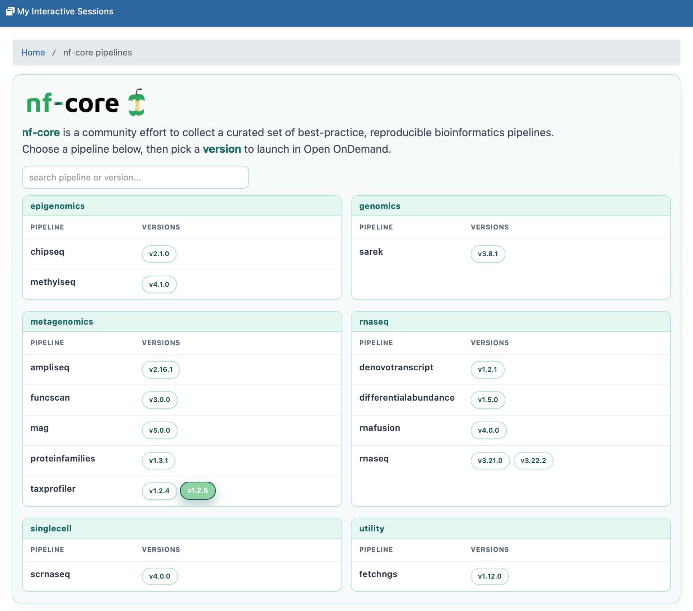
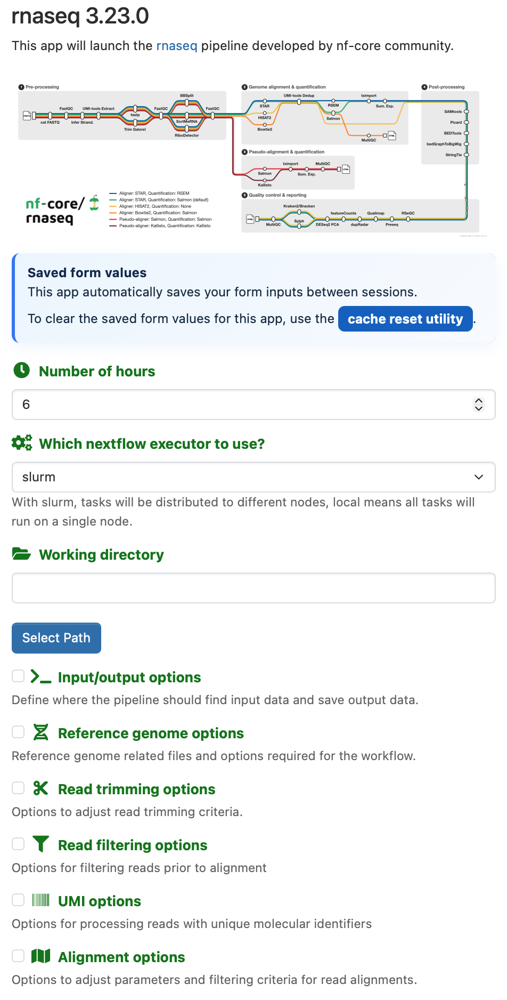

# nf-core Dashboard App for Open OnDemand

This app provides a single Open OnDemand entry point for a collection of versioned `nf-core-*` pipeline apps. It groups child apps by `subcategory`, collapses multiple versions of the same pipeline into one listing, and links users to the corresponding launch forms.

This repository contains only the parent dashboard app. To make it usable, you must also install the companion pipeline-app repository: [TuftsRT/tufts-ood_nfcore_pipelines](https://github.com/TuftsRT/tufts-ood_nfcore_pipelines).

## Purpose

This directory is the parent or landing-page app for the nf-core apps in this repository. It is intended to reduce menu clutter in Open OnDemand by exposing one nf-core dashboard page instead of many separate app tiles.

## Key Features

- Discovers child apps from `manifest.yml` files under the Open OnDemand system app directory.
- Groups pipelines by `subcategory` and versions by app name.
- Links directly to existing child Batch Connect apps.
- Supports hiding child apps from top-level navigation while keeping them available from this dashboard.

## User Interface Overview

### nf-core Dashboard

The parent app provides a single dashboard entry point where users can browse available nf-core workflows and launch specific versions.



### Individual Pipeline App Form

The parent dashboard links to individual pipeline-app forms where users configure workflow inputs, resources, and optional parameters.



## How It Works

The current implementation is primarily a dashboard integration, not a self-contained standalone app. The files in this directory are used to extend the existing Open OnDemand dashboard:

- `controllers/nf_pipelines_controller.rb` builds the grouped pipeline catalog from installed child apps.
- `initializers/nf_core_dashboard_route.rb` adds the dashboard route.
- `views/index.html.erb` renders the dashboard page inside Open OnDemand.

The code expects child apps to:

- have names that begin with `nf-core-`
- be Batch Connect apps
- use `manifest.yml` metadata such as `name` and `subcategory`

## Installation

1. Download or clone this repository for the parent dashboard app.
2. Download or clone the companion pipeline repository: [TuftsRT/tufts-ood_nfcore_pipelines](https://github.com/TuftsRT/tufts-ood_nfcore_pipelines).
3. Install this directory under your Open OnDemand system apps path, typically `/var/www/ood/apps/sys/nf-core`.
4. Install the child `nf-core-*` apps from the companion repository under the same system apps path.
5. Link the controller, route initializer, and dashboard view into the dashboard customization locations used by your Open OnDemand deployment.
6. Restart or refresh the dashboard so the new route and view are loaded.

A typical deployment looks like this:

These symlinks are needed because this app does not replace the full Open OnDemand dashboard. Instead, it adds three small integration points into the existing dashboard codebase:

- `nf_pipelines_controller.rb`: adds a dashboard controller action that discovers the installed `nf-core-*` child apps and groups them for display.
- `views/index.html.erb`: provides the dashboard page template that renders the nf-core landing page inside the existing Open OnDemand dashboard.
- `nf_core_dashboard_route.rb`: registers the route so the dashboard knows where the nf-core page lives.

Using symlinks keeps the parent app self-contained in one repository while still allowing Open OnDemand's dashboard to load these files from the locations where it expects controllers, views, and initializers. It also makes updates easier, because you can update the files in the app directory without maintaining a forked copy of the full dashboard application.

```bash
sudo ln -s /var/www/ood/apps/sys/nf-core/controllers/nf_pipelines_controller.rb \
  /var/www/ood/apps/sys/dashboard/app/controllers/nf_pipelines_controller.rb

sudo mkdir -p /etc/ood/config/apps/dashboard/views/nf_pipelines
sudo ln -s /var/www/ood/apps/sys/nf-core/views/index.html.erb \
  /etc/ood/config/apps/dashboard/views/nf_pipelines/index.html.erb

sudo mkdir -p /etc/ood/config/apps/dashboard/initializers
sudo ln -s /var/www/ood/apps/sys/nf-core/initializers/nf_core_dashboard_route.rb \
  /etc/ood/config/apps/dashboard/initializers/nf_core_dashboard_route.rb
```

## Configuration

The dashboard implementation relies on installed child apps rather than a hand-maintained catalog file.

Relevant runtime assumptions:

- Child apps are installed under the system app directory.
- Child apps use names like `nf-core-rnaseq-3-23-0`.
- Child app `manifest.yml` files provide readable `name` and `subcategory` values.
- Child apps may use empty categories so they stay hidden from the main navigation.

The Rack app code in `app.rb` also references `NF_CORE_APPS_DIR` and `OOD_DASHBOARD_BASE`, but the main deployment path in this repository is the dashboard controller/view integration described above.

## Usage

1. Open the nf-core dashboard page in Open OnDemand.
2. Browse by pipeline group or search by pipeline/version.
3. Select a pipeline version.
4. Complete the child app form and submit the workflow.

## Important Notes and Limitations

- This app is not the workflow launcher itself; the child apps handle submission.
- The current grouping logic depends on manifest naming conventions and app names.
- The repository includes a sample `config/pipelines.yml`, but the dashboard controller does not use it at runtime.
- The Rack app stub in `app.rb` references a template path that is not the main path used by the deployed dashboard integration.

## Files

- `manifest.yml`: metadata for the parent app
- `controllers/nf_pipelines_controller.rb`: dashboard controller
- `initializers/nf_core_dashboard_route.rb`: route extension
- `views/index.html.erb`: dashboard page
- `app.rb` and `config.ru`: alternate Rack-based implementation artifacts

## Deployment Notes

Before publishing, confirm that:

- the integration instructions match your target Open OnDemand version
- the child apps you want to expose are installed and launch correctly
- hidden child apps remain discoverable through this dashboard
- the README describes this as a dashboard integration layer rather than a turnkey standalone app
